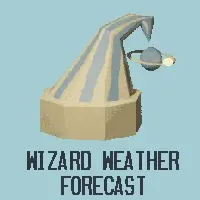
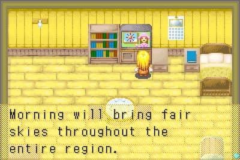
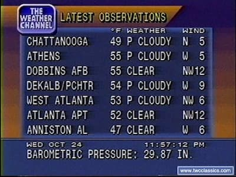

# Weather Channel

## Elevator pitch

A weather app inspired by the TV from [Harvest Moon: More Friends of Mineral Town](https://en.wikipedia.org/wiki/Harvest_Moon:_Friends_of_Mineral_Town). 

It has an alternate display for people who browse with javascript disabled.

^ the TV in question

## Technology used and design decisions

- Rather than hard numbers, I populated the weather report with the [`"summary"` values](https://github.com/Pirate-Weather/pirate-weather-code/blob/dev/API/PirateDailyText.py) from the [Pirate Weather API](https://pirate-weather.apiable.io/products/weather-data/details) response. I find the direct and clunky sentences quite charming.

- I used [node-geocoder](https://www.npmjs.com/package/node-geocoder) and [TomTom's Geocoding API](https://developer.tomtom.com/geocoding-api/documentation/geocode) for, well...geocoding. The coordinates are accurate enough but the values for location names such as `"city"` or `"streetName"` tend to be `undefined`. I used the first item of the response array and extract the `"state"` and `"country"` values for the displayed location.

  -  I could have used google's highly accurate Geocoding API but I'm trying to wean myself off google products.

- This project came to me in a shock of divine inspiration when I watched the youtube video ["weather channel vaporwave"](https://youtu.be/k_Dwg_x48Rw?si=1DY2Jt_p1mZj_p3V). I wanted to capture the cozy nostalgic feeling.

^ weatherSTAR 4000 display

- I tried to emulate The Weather Channel's [WeatherSTAR 4000 display](https://twcclassics.com/information/weatherstar-4000-flavors.html) while styling the page, from its orange-indigo gradient to the blue information boxes.

  - Note: I actually used the [weatherSTAR 3000 font](https://twcclassics.com/downloads.html) for the header and footer.

- To get the "fuzzy" feel of old TV, I put scanlines on top of everything, adapting a pared down of this ["Pure CSS Scanlines Effect" codepen](https://codepen.io/ynef/pen/yvvyGv).

- I used [htmx](https://htmx.org/) to enable the TV text to "advance" onclick without refreshing the page. Otherwise, I'd need a front end framework, which seems like overkill...

- The reporter and weather icons are drawn/3d-modelled by me! >:)
